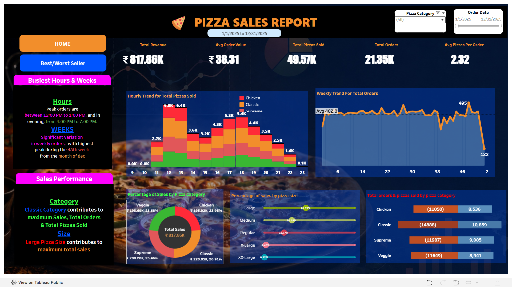
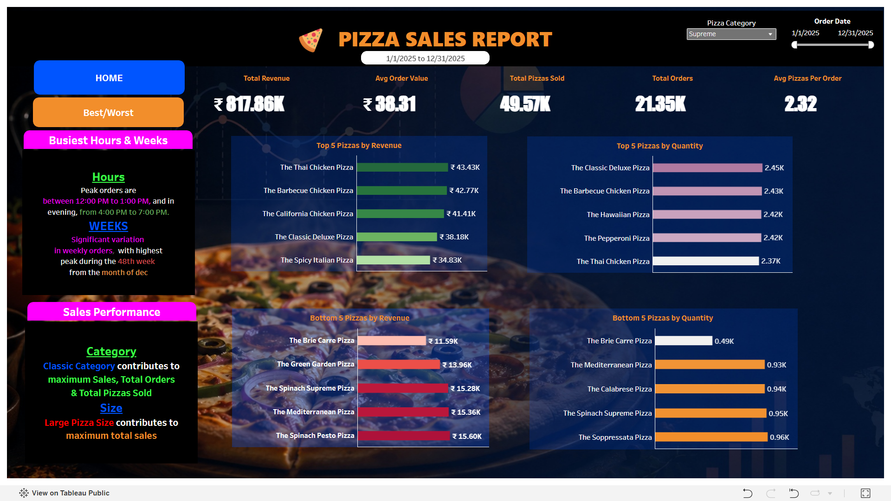

#                                                                         Pizza_Sales_Dashboard_Report

# 🍕 Pizza Sales Dashboard (Tableau)

An interactive Tableau dashboard analyzing a full year of pizza sales transactions — orders, revenue, categories, sizes, and timing — to help a pizza business understand what's selling, when it's selling, and how individual menu items are performing. Built as a two-page dashboard (**Home** overview + **Best/Worst Sellers** performance page), both connected to a single sales data source.

🔗 **Live dashboard:** [View on Tableau Public](https://public.tableau.com/views/PizzaReportTab/Home?:language=en-US&publish=yes)

## 📌 Problem Statement

A pizza business generates large volumes of raw transactional data (every order, every pizza, every timestamp) — but that data on its own doesn't answer the questions that actually run the business:
- Which days/hours drive the most orders, and is sales trending up or down over time?
- Which pizza categories and sizes make up the bulk of revenue?
- Which specific pizzas are top performers — and which are underperforming or worth dropping from the menu?
- Is the business getting enough value (revenue) per order and per pizza sold?

Without a consolidated view, answering these would mean manually querying raw data and building ad-hoc spreadsheets every time someone asks — slow, inconsistent, and hard to monitor over time. This dashboard replaces that with a single, self-service, always-current view.

## 🔑 Key Findings & Insights

- Total revenue for the period was **₹817.86K**, generated from **21.35K** orders and **49.57K** pizzas sold.
- **Thai Chicken Pizza** was the top-selling pizza by revenue, while **Spicy Italian Pizza** ranked lowest — suggesting a possible menu/pricing review.
- **Classic Pizza** category drove the largest share of sales (**26.91%**), showing where customer preference concentrates.
- Order volume peaked around **12 hour/day**, useful for staffing and inventory planning during rush periods.
- **Large** was the most popular size (**45.89%** of sales), while **XX-Large**(Extra large) made up the smallest share (**0.12%**) — useful for portion/pricing strategy.
- **Thai Chicken** tops revenue despite low quantity sold — a premium, high-margin item. **Classic Deluxe** leads in quantity but ranks 4th in revenue — high-volume, lower-price. Signals a menu-mix opportunity: push Thai Chicken for margin, bundle Classic Deluxe for volume.

 

## 💡 Business Impact 

This dashboard supports decisions such as:
- **Staffing & inventory planning** — daily/hourly order trends show when to schedule more staff or stock more ingredients ahead of peak periods.
- **Menu engineering** — the Best/Worst Sellers page flags pizzas that consistently underperform on revenue or quantity, candidates for repricing, promotion, or removal — and highlights top performers worth protecting or featuring.
- **Category/size strategy** — the sales-mix charts show whether revenue concentrates in a few categories or sizes, informing pricing or upsell strategy (e.g., promoting upgrades to larger sizes if smaller sizes dominate).
- **Order economics** — Avg Order Value and Avg Pizzas per Order indicate how much each transaction is worth, a lever for combo deals or upsell tactics.

> ⚠️ **Data quality note:** Double-check the direction of the `Avg Order Value` calculation (should be `Total Revenue/Total Orders`, not the inverse) before using it to drive decisions — this is a common mistake worth verifying in any workbook.

## 🛠️ Tools Used

- **Tableau Desktop / Public** — dashboard design & data visualization
- **CSV (pizza_sales_2025.csv)** — raw source data (order-level pizza sales)
- **Tableau Calculated Fields (LOD/basic)** — for KPIs like Total Revenue, Avg Order Value, Avg Pizzas per Order

## 📊 Dashboard Structure

**Home Dashboard**
- KPI Banner (Total Revenue, Total Orders, Total Pizzas Sold, Avg Order Value, Avg Pizzas/Order)
- Weekly Trend for Total Orders
- Hourly Trend for Total Pizzas Sold
- Total Orders & Pizzas Sold by Pizza Category
- % of Sales by Pizza Category
- % of Sales by Pizza Size
- Date Range filter

**Best/Worst Seller Dashboard**
- Top 5 Pizzas by Revenue
- Top 5 Pizzas by Quantity
- Bottom 5 Pizzas by Revenue
- Bottom 5 Pizzas by Quantity

## 🧠 Why These Chart Types

| Visual | Chart Type | Reasoning |
|---|---|---|
| KPI Banner | Cards | Surfaces the headline numbers at a glance — no interpretation needed for metrics people check first. |
| Weekly Trend for Total Orders | Line/Column | Standard for comparing a metric across discrete time periods; makes busiest days/weeks easy to spot. |
| Hourly Trend for Total Pizzas Sold | Line Chart | Emphasizes trend over a continuous timeline — useful for spotting rush hours. |
| % of Sales by Pizza Category / Size | Pie/Donut-style | Best suited for part-to-whole comparisons across a small number of categories. |
| Top/Bottom 5 by Revenue & Quantity | Horizontal Bar | Ranked comparisons read best as horizontal bars, especially with long pizza-name labels that would otherwise truncate or rotate. |
| Date Range | Filter | Lets users drill into any specific period without editing the report — key for self-service exploration. |

## 📂 Files

- `Pizza_Report_Tab.twb` — Tableau workbook (open in Tableau Desktop/Public)
- `pizza_sales_2025.csv` — source data *(add to repo if sharing publicly, or link to dataset source)*

## ℹ️ Additional Notes

- **Data prep applied:** pizza size codes relabeled for readability (L → Large, M → Medium, S → Regular, X → X-Large, XX-Large → Extra large); helper fields (Day/Month Number) derived from `order_date` to support correct trend-chart sorting.
- The workbook connects to a local CSV extract by default — if you open it and the connection breaks, repoint it to your own copy of `pizza_sales_2025.csv`.

## 🚀 How to View

1. Download `Pizza_Report_Tab.twb`
2. Open in [Tableau Desktop](https://www.tableau.com/products/desktop) or [Tableau Public](https://public.tableau.com/)
3. Ensure the CSV data source path is updated to your local file location if the connection breaks
4. Or just view it live: [Tableau Public link](https://public.tableau.com/views/PizzaReportTab/Home?:language=en-US&publish=yes)
